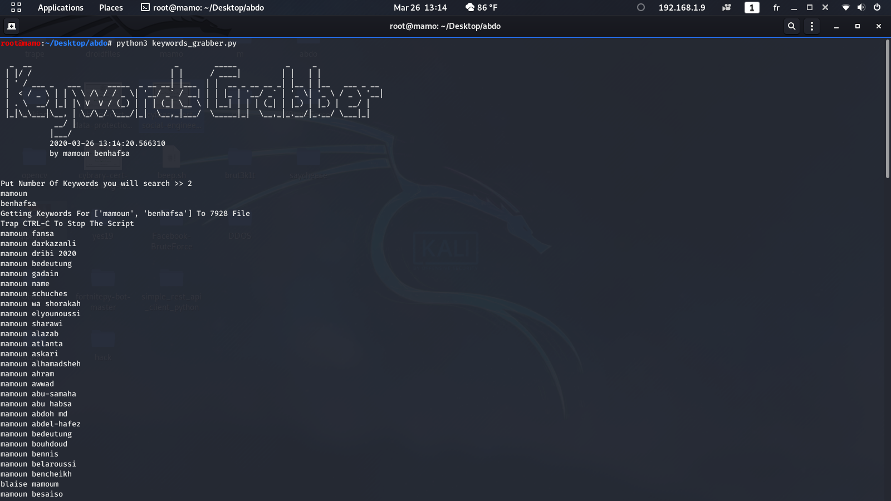

# google-keywords-grabber
google-keywords-grabber

# depencies
apt install python3 pip3
pip3 install google &&
pip3 install requests &&
pip3 install string
## Run:
python3 keywords_grabber.py
2 --> 2 keywords choose
mamoun
benhafsa
screenshoot.png  --> enter 
# wait until finish or trap ctrl+c To Stop Then You Will See Some Random name File Like 1244 
