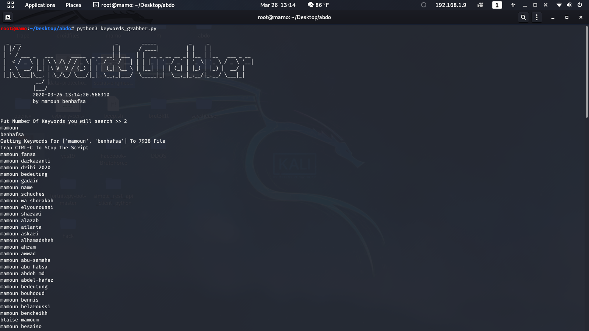

# google-keywords-grabber
google-keywords-grabber

##depencies
#python3
#pip3 install google
#pip3 install requests
#pip3 instamm string
##Run:
#python3 keywords_grabber.py
#2 --> 2 keywords choose
#mamoun
#benhafsa
#  --> enter 
#wait until finish or trap ctrl+c To Stop Then You Will See Some Random name File Like 1244 
